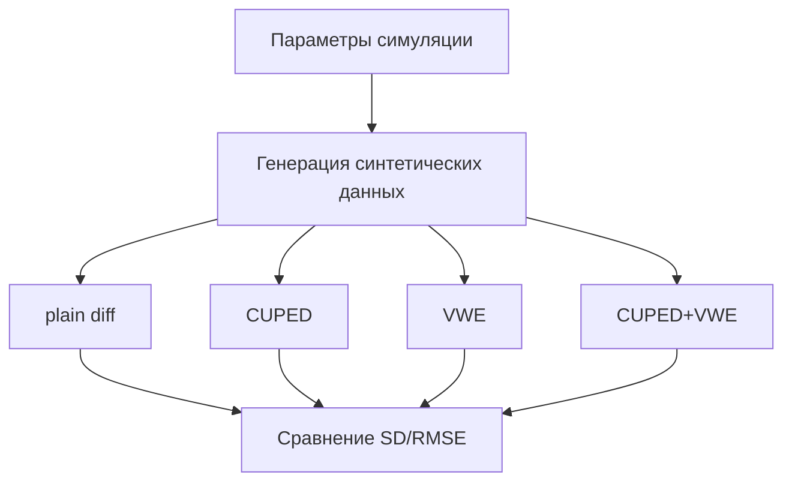

# CUPED vs VWE Experiments

## Кратко
Воспроизводимые симуляции для сравнения plain diff, CUPED, VWE и CUPED+VWE на синтетических A/B-данных.

## Задача
Понять, когда использование предэкспериментальных сигналов и variance weighting действительно снижает дисперсию оценки эффекта и улучшает устойчивость вывода.

## Что улучшено
- CUPED снижает дисперсию при высокой pre/post корреляции;
- VWE помогает при гетерогенной шумности;
- комбинация CUPED+VWE может быть устойчивой в mixed-сценариях.

## Архитектура


## Метрики и результаты
Подставить реальные значения из `figures/*.csv`.

| Метод | std(estimate) | rmse(estimate) | Относительное снижение дисперсии |
|---|---:|---:|---:|
| plain diff | TBD | TBD | 0% |
| CUPED | TBD | TBD | TBD |
| VWE | TBD | TBD | TBD |
| CUPED+VWE | TBD | TBD | TBD |

## Запуск
```bash
python -m venv .venv
source .venv/bin/activate
pip install -r requirements.txt
python scripts/make_figures.py
```
