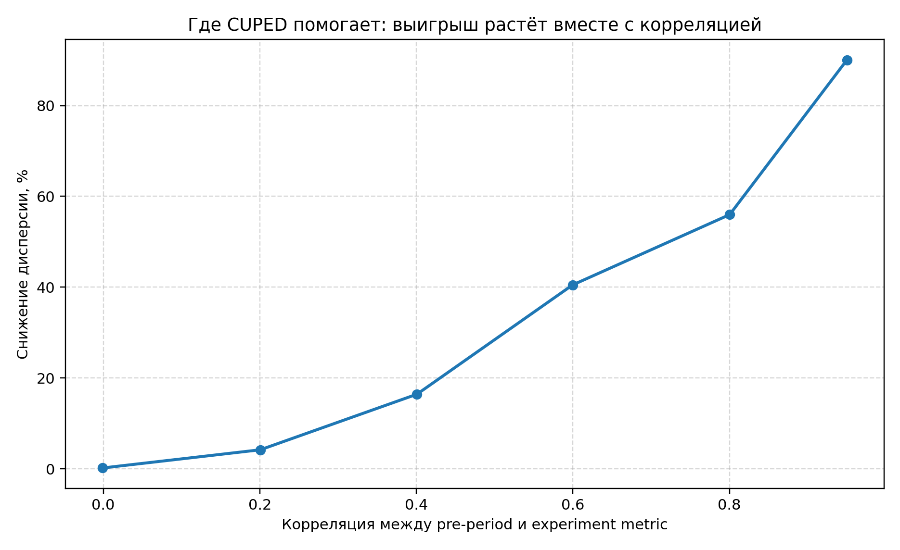
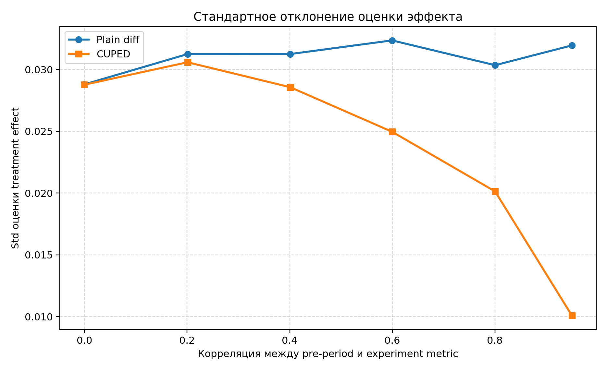
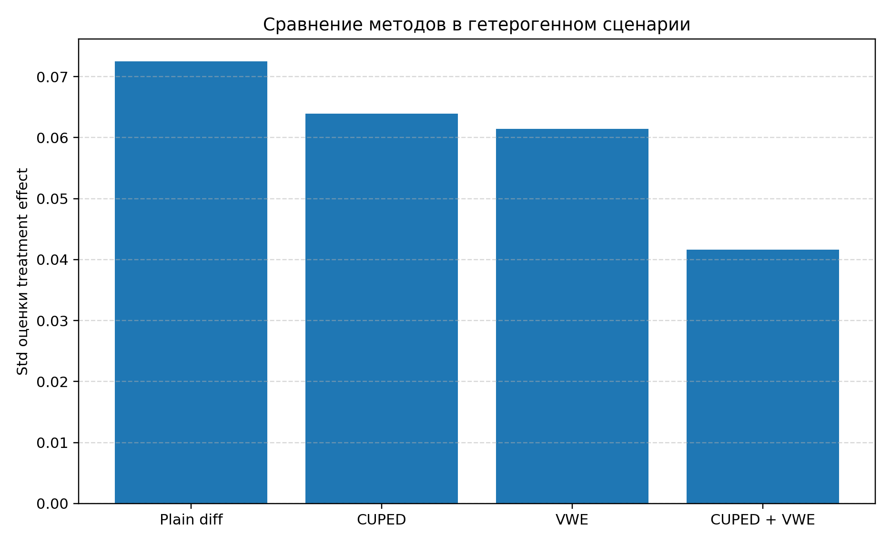

# CUPED без магии и когда нужен VWE: что реально уменьшает дисперсию в A/B-тестах

Когда продуктовый эксперимент не показывает эффект, это не всегда означает, что эффекта нет. Иногда он теряется в шуме метрики.

Обычно дальше команда делает одно из трёх: увеличивает трафик, продлевает тест или спорит о «слабом продукте». Есть и четвёртый путь — уменьшить дисперсию оценки. Для этого часто вспоминают CUPED. Реже — VWE. И ещё реже проговаривают вслух, что это **разные инструменты против разного шума**.

Ниже разобраны две простые идеи:

1. **CUPED** даёт заметный выигрыш, когда есть доэкспериментальная ковариата, действительно связанная с метрикой в тесте.
2. **VWE** становится уместен, когда проблема не только в уровне метрики, но и в том, что часть пользователей сильно более шумная, чем остальные.

Здесь не предлагается новый метод и не утверждается, что синтетика заменяет прод. Цель скромнее: воспроизводимый учебный эксперимент, который помогает не смешивать разные источники дисперсии. Числа в тексте согласованы с `figures/correlation_study.csv` и `figures/power_user_study.csv` при конфигурации по умолчанию в коде (`n_units=4000`, `n_sims=300`, `seed=42`, истинный эффект `0`).

## Почему вообще CUPED снижает дисперсию

Идея CUPED из работы Microsoft сводится к следующему: если есть pre-period метрика `X`, связанная с экспериментальной метрикой `Y`, можно вычесть из `Y` ту часть, которую объясняет `X`.

В простом виде:

`Y_cuped = Y - θ (X - E[X])`, где `θ = cov(Y, X) / var(X)`.

Интуиция важнее формулы: если часть будущего вклада пользователя в метрику предсказуема из прошлого, её не обязательно считать неструктурированным шумом — её можно вычесть и оставить более ровный остаток.

Ключевой вывод: **выигрыш CUPED определяется не самим фактом наличия исторической фичи, а корреляцией с целевой метрикой**.

## Где CUPED переоценивают

CUPED часто воспринимают как почти универсальную variance-reduction поправку, но на практике выигрыш сильно зависит от данных.

Типичные переоценки:

- ковариата слабо связана с outcome;
- историческая метрика измерена после триггера или смешаны pre- и post-treatment сигнал;
- ожидают, что CUPED «вылечит» ситуацию, где основной шум — экстремальная гетерогенность дисперсии по юнитам.

В первых двух случаях выигрыш мал. В третьем CUPED может помочь частично, но источник шума другой — и отдельно имеет смысл смотреть на веса по надёжности юнита.

## Симуляция 1. Что даёт корреляция

В первой симуляции задаётся pre-period метрика `X` и экспериментальная `Y` с контролируемой корреляцией. На 300 независимых прогонах сравнивается стандартное отклонение оценки эффекта для разницы средних и для CUPED (сетка целевых ρ: 0, 0.2, …, 0.95).

Главный график:

По таблице `correlation_study.csv` в этом прогоне:

- при ρ≈0 доля снижения дисперсии относительно plain diff близка к нулю (порядка 0,2%);
- при ρ≈0.6 — около 40%;
- при ρ≈0.95 — около 90%.

То есть **CUPED убирает не «любой шум», а в основном ту часть, которую тянет коррелированная pre-ковариата**.

Вторая иллюстрация — те же оценки через стандартное отклонение:

## Но что если проблема не только в корреляции?

Во второй симуляции рассматривается смесь из 88% относительно стабильных пользователей и 12% более шумных (power users). В коде у последних стандартное отклонение внутриюнитного шума в пять раз выше, чем у остальных (`power_sd=5`, `stable_sd=1` в `simulate_power_user_dataset`), плюс общий разброс уровня baseline.

Даже при хорошей pre-ковариате часть шума остаётся: нестабильные юниты непропорционально раздувают дисперсию оценки.

Здесь появляется **VWE** — оценка с весами, обратными оценённой дисперсии юнита. В публикациях Meta/Facebook такие веса строят из pre-experiment данных; здесь — из повторных pre-наблюдений, см. `estimate_unit_variances` в коде.

## Симуляция 2. Когда одной CUPED мало

Моделируются стабильные и «шумные» пользователи, повторные pre-наблюдения для оценки дисперсии по юниту, затем сравниваются четыре варианта: plain diff, CUPED, VWE, CUPED+VWE.

RMSE оценки эффекта (истинный эффект нулевой), тот же прогон:

Стандартные отклонения оценок:

По `power_user_study.csv` (округление до трёх знаков):

| Метод        | RMSE  | SD оценки |
|-------------|-------|-----------|
| Plain diff  | 0,073 | 0,073     |
| CUPED       | 0,064 | 0,064     |
| VWE         | 0,061 | 0,061     |
| CUPED + VWE | 0,042 | 0,042     |

В **этом сценарии** комбинация CUPED и VWE даёт наименьшую разбросность и RMSE: методы бьют по разным компонентам шума. Переносить этот вывод на любой продуктовый эксперимент без дополнительной проверки данных нельзя.

У взвешенных схем средняя эффективная выборка по весам в этом прогоне около **2550** при номинальных 4000 юнитах — цена перераспределения веса в сторону более стабильных юнитов.

## Что из этого брать в работу

### Когда в первую очередь смотреть на CUPED

- есть качественная pre-ковариата, измеренная до treatment;
- заметная связь с outcome;
- основной шум — межпользовательская систематика уровня, а не доминирование нескольких крайне нестабильных юнитов.

### Когда имеет смысл думать про VWE

- есть повторные наблюдения или иной способ оценить дисперсию на уровне юнита;
- видно, что небольшая доля пользователей раздувает дисперсию оценки;
- CUPED уже даёт выигрыш, но чувствительности всё ещё не хватает — и важно проверить, не уходит ли шум в «тяжёлых» юнитах.

## Ограничения эксперимента

1. **Синтетика — не прод.** Это объясняющий эксперимент, а не claim про универсальный uplift в любой компании.
2. **VWE здесь упрощён:** воспроизводится интуиция и порядок величин, а не полная production-реализация из статьи.
3. **Смотрим на дисперсию и RMSE оценки**, а не на полный бизнес-процесс: на практике добавляются устойчивость к смещению, стоимость внедрения, мониторинг весов.
4. **Комбинация CUPED+VWE не означает универсального преимущества** — всё зависит от структуры данных и качества оценки дисперсий.

## Вывод

CUPED и VWE удобно держать в голове не как «две фичи на выбор», а как ответы на разные причины шума:

- **CUPED** уменьшает объяснимую через pre-ковариату вариативность;
- **VWE** ослабляет влияние нестабильных юнитов, когда они портят чувствительность.

При выборе инструмента важнее не название метода, а структура шума в конкретной метрике и то, подтверждается ли она данными.

---

## Источники

1. Deng et al. *Improving the Sensitivity of Online Controlled Experiments by Utilizing Pre-Experiment Data*.
2. Liou et al. *Variance-Weighted Estimators to Improve Sensitivity in Online Experiments*.
3. Meta Research blog: *Increasing the sensitivity of A/B tests by utilizing the variance estimates of experimental units*.
